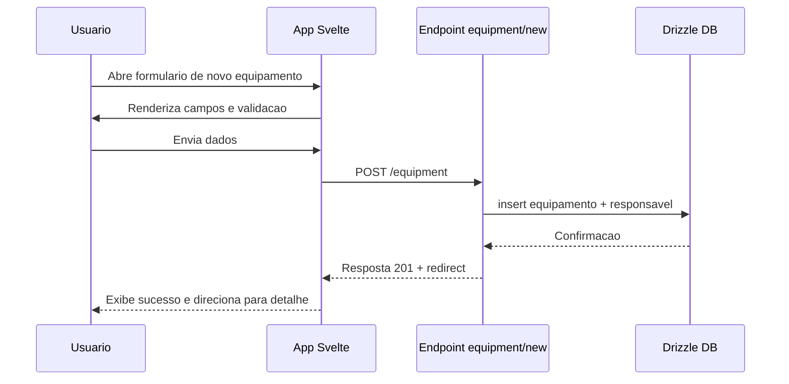
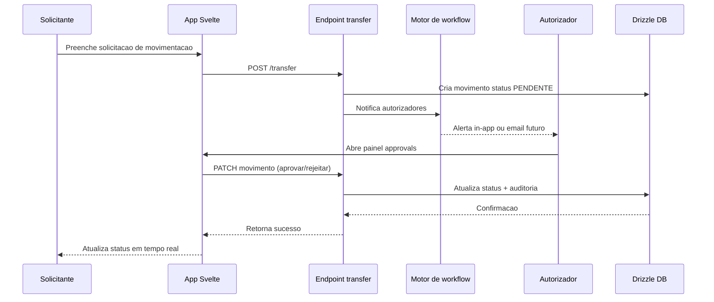
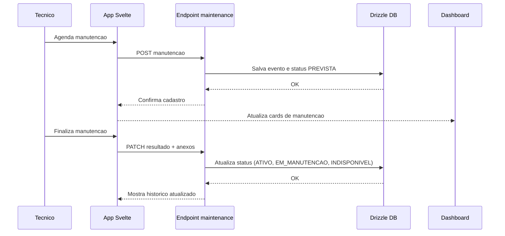

# Specification Document (use Mermaid.js, also use sequence diagrams)

> This document mirrors;

- SPEC.md
- src/routes/doc/spec/+page.md

---

## Gestao de Equipamentos

### Visao Geral
- Sistema web para ciclo de vida completo de equipamentos corporativos.
- Integra autenticacao existente para garantir acesso controlado.
- Proporciona rastreabilidade, auditoria e historico detalhado.
- Disponibiliza fluxo de movimentacao com autorizacoes formais.

### Escopo Funcional
- **Autenticacao**: reutilizar fluxo em `src/routes/user` garantindo protecao do modulo.
- **Dashboard operacional**: `src/routes/equipment/+page.svelte` com filtros, cards de alertas e listagem.
- **Cadastro e edicao**: `src/routes/equipment/new/+page.svelte` e `src/routes/equipment/[id]/edit/+page.svelte` com validacao, anexos e criticidade.
- **Detalhe**: `src/routes/equipment/[id]/+page.svelte` apresentando status, localizacao e timeline.
- **Localizacoes**: `src/routes/equipment/locations/+page.svelte` para CRUD hierarquico (matriz, filial, sala).
- **Movimentacao**: `src/routes/equipment/[id]/transfer/+page.svelte` com solicitacao, motivo, origem, destino e pre-aprovacao.
- **Aprovacoes**: `src/routes/equipment/approvals/+page.svelte` para autorizadores com historico e comentarios.
- **Manutencoes**: `src/routes/equipment/[id]/maintenance/+page.svelte` para agendamento e encerramento.
- **Auditoria**: `src/routes/equipment/history/+page.svelte` consolidando eventos.
- **Relatorios**: `src/routes/equipment/reports/+page.server.ts` exporta CSV/Excel com filtros reutilizando utilitarios em `src/lib/utils`.
- **Stores**: `src/lib/stores/equipment.ts` centraliza estado compartilhado (filtros, selecoes, cache).
- **Componentes**: aproveitar `src/lib/components/ui` para tabelas, dialogs e timeline; criar componentes especificos quando necessario.

### Fluxo de Cadastro Inicial

### Fluxo de Movimentacao e Aprovacao

### Fluxo de Manutencao Preventiva

### Requisitos de Dados
- Atualizar `src/lib/db/schema.ts` com tabelas `equipment`, `location`, `equipment_movement`, `equipment_maintenance`, `equipment_audit_log` e politicas de autorizacao.
- Garantir enums para status, criticidade, tipo de manutencao e tipo de local.
- Prever colunas de auditoria (`created_at`, `updated_at`) conforme necessidade de trilha.
- Documentar ERD correspondente em `src/lib/db/schema.md`.

### Regras de Negocio
- Nao permitir movimentacao sem autorizador valido.
- Bloquear manutencao em equipamento com status `inativo`.
- Atualizar status automaticamente ao concluir movimentacao ou manutencao.
- Registrar eventos em auditoria para cada acao sensivel.

### Testes
- Unitarios para stores e funcoes utilitarias do modulo.
- Testes server-side para validacao de regras e workflow.
- Fluxos E2E cobrindo cadastro, movimentacao com aprovacao, rejeicao e manutencao.

### Evolucao Futura
- Integracoes com ERP via API REST em `src/routes/equipment/+server.ts`.
- Importacao em massa CSV com validacoes server-side.
- Notificacoes assincronas integradas a filas existentes.
