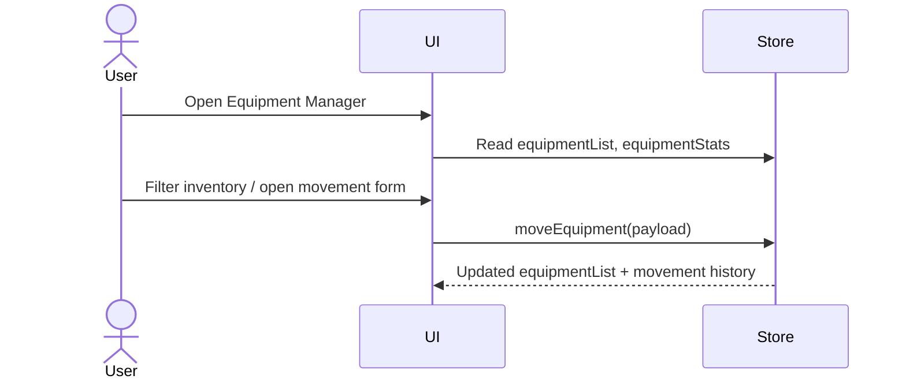

# Specification Document (use Mermaid.js, also use sequence diagrams)

> This document mirrors;

- SPEC.md
- src/routes/doc/spec/+page.md

---

## Equipment Management Module

- Scope: inventory tracking, allocation workflow, maintenance visibility
- Entry point: `src/routes/equipment/+page.svelte`
- State: in-memory stores at `src/lib/stores/equipment.ts`
- Navigation: label `softwareEquipmentManager` (shown in sidebar)

### User Flow (Mermaid)



### Core Data Structures

```16:95:src/lib/stores/equipment.ts
export interface EquipmentRecord {
	id: string;
	assetTag: string;
	name: string;
	category: string;
	status: EquipmentStatus;
	currentLocation: string;
	custodian: string;
	authorizer: string;
	lastMovementAt: string;
}
```

### Key Interactions

- `moveEquipment` updates location, custodian, status, and appends a movement log entry
- `addEquipment` prepends a new record and emits an initial movement with audit data
- Page tabs provide inventory, movement, and quick registration views with toast feedback