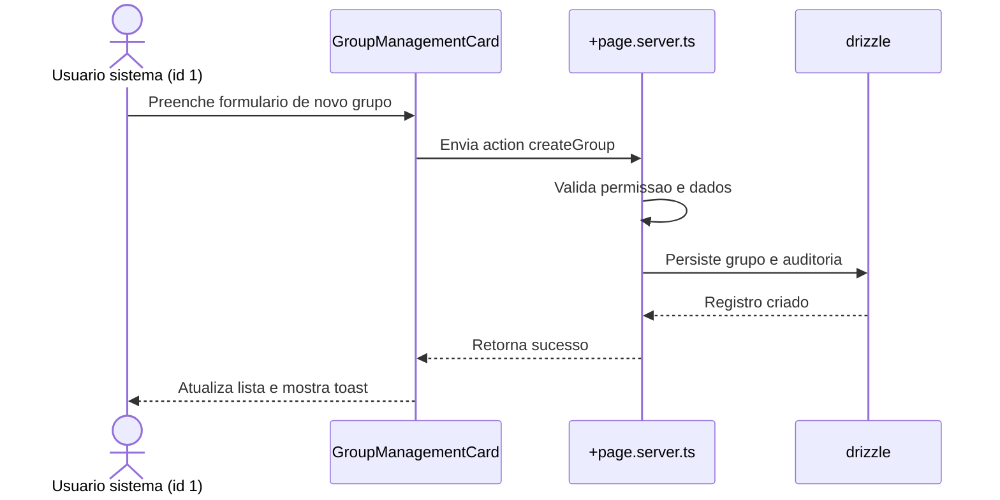
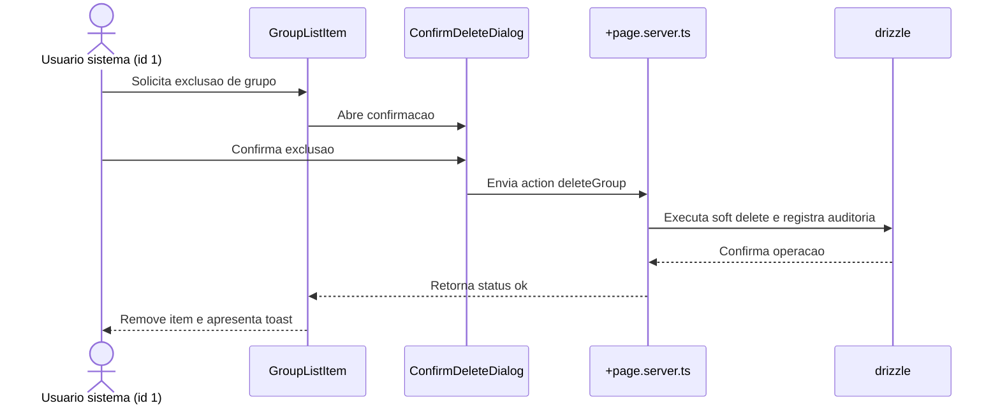

# Specification Document (use Mermaid.js, also use sequence diagrams)

> This document mirrors;

- SPEC.md
- src/routes/doc/spec/+page.md

---

## Funcionalidade: Gerenciamento de grupos do usuario sistema

### Contexto
- Permitir que o usuario mestre (id 1, criado no bootstrap da plataforma) gerencie grupos diretamente em `user/profile`.
- Manter rastreabilidade de quem executa cada acao e garantir mensagens internacionalizadas.
- Preservar arquitetura modular existente em `src/routes/user` e manter validacoes no backend com drizzle.

### Regras de negocio
- Card visivel somente quando `locals.user.id === '1'`.
- Acoes disponiveis: criar grupo com nome e descricao opcionais e excluir grupos existentes via confirmacao.
- Registrar auditoria de criacao e exclusao utilizando tabelas dedicadas.
- Impedir que grupos com membros ativos sejam removidos sem verificacoes adicionais.

### Implementacao
- `src/routes/user/profile/+page.svelte`: renderizar `GroupManagementCard` com formulario inline, lista de grupos e confirm modal.
- `src/routes/user/profile/+page.server.ts`: fornecer `load` com grupos e contagens, actions `createGroup` e `deleteGroup` protegidas por permissao do usuario mestre.
- `src/lib/components/user/GroupManagementCard.svelte` e subcomponentes `GroupForm`, `GroupList`, `GroupListItem`, `ConfirmDeleteDialog` para UI reutilizavel.
- `src/lib/utils/groups.ts`: validacoes de entrada (nome, descricao) e formatadores.
- `src/lib/db/schema.ts`: adicionar tabelas `group`, `userGroup` e `groupAuditLog` com campos de auditoria (createdAt, createdById, deletedAt, deletedById).
- Adicionar migracoes drizzle correspondentes e seeds iniciais quando necessario.
- Atualizar `messages/*.json` com chaves de texto (labels, tooltips, toasts) sincronizadas via `project.inlang`.

### Fluxo principal

### Fluxo de remocao

