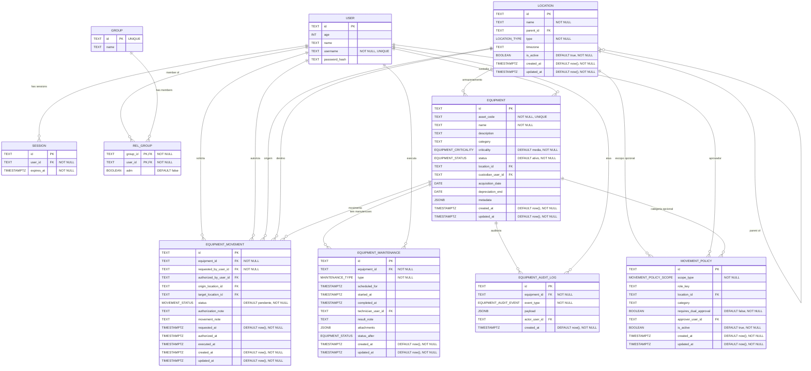

# Database Schema (Mermaid)

> This document mirrors; Update this file whenever the TypeScript schema changes!

- src/lib/db/schema.ts.
- src/routes/doc/schema/+page.md

Details and constraints

- session.user_id → user.id (foreign key, required)
- user.username is UNIQUE and NOT NULL
- session.expires_at uses a timestamp with timezone (mode: date) and is NOT NULL
- group.id is UNIQUE and serves as the primary key
- rel_group has a composite primary key (group_id, user_id)
- rel_group.group_id → group.id (foreign key, required)
- rel_group.user_id → user.id (foreign key, required)
- rel_group.adm is a boolean flag indicating admin status
- location.parent_id → location.id (opcional, permite hierarquia)
- equipment.location_id → location.id (opcional)
- equipment.custodian_user_id → user.id (opcional)
- equipment_movement.equipment_id → equipment.id (obrigatorio)
- equipment_movement.requested_by_user_id → user.id (obrigatorio)
- equipment_movement.authorized_by_user_id → user.id (opcional)
- equipment_movement.origin_location_id → location.id (opcional)
- equipment_movement.target_location_id → location.id (opcional)
- equipment_maintenance.equipment_id → equipment.id (obrigatorio)
- equipment_maintenance.technician_user_id → user.id (opcional)
- equipment_audit_log.equipment_id → equipment.id (obrigatorio)
- equipment_audit_log.actor_user_id → user.id (opcional)
- movement_policy.location_id → location.id (opcional)
- movement_policy.approver_user_id → user.id (opcional)
- Enums definidos: EQUIPMENT_STATUS, EQUIPMENT_CRITICALITY, LOCATION_TYPE, MOVEMENT_STATUS, MAINTENANCE_TYPE, EQUIPMENT_AUDIT_EVENT, MOVEMENT_POLICY_SCOPE
