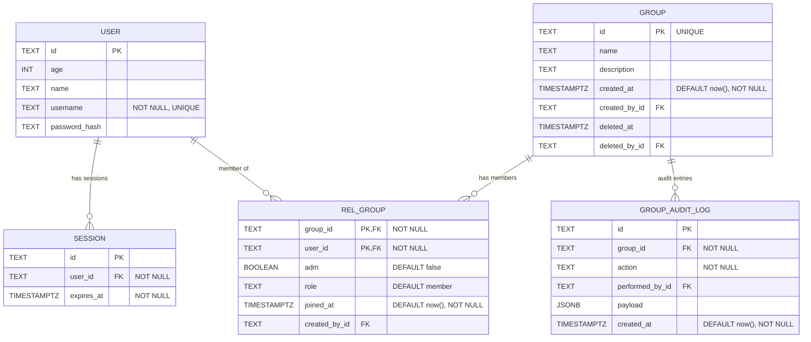

# Database Schema (Mermaid)

> This document mirrors; Update this file whenever the TypeScript schema changes!

- src/lib/db/schema.ts.
- src/routes/doc/schema/+page.md

Details and constraints

- session.user_id → user.id (foreign key, required)
- user.username is UNIQUE and NOT NULL
- session.expires_at uses a timestamp with timezone (mode: date) and is NOT NULL
- group.id is UNIQUE and serves as the primary key
- group.created_at defaults to now() to register when it was created
- group.created_by_id and group.deleted_by_id reference user.id for auditability
- rel_group has a composite primary key (group_id, user_id)
- rel_group.group_id → group.id (foreign key, required)
- rel_group.user_id → user.id (foreign key, required)
- rel_group.adm is a boolean flag indicating admin status
- rel_group.role defaults to member and joined_at defaults to now()
- group_audit_log records create and delete actions per group with optional payload metadata
