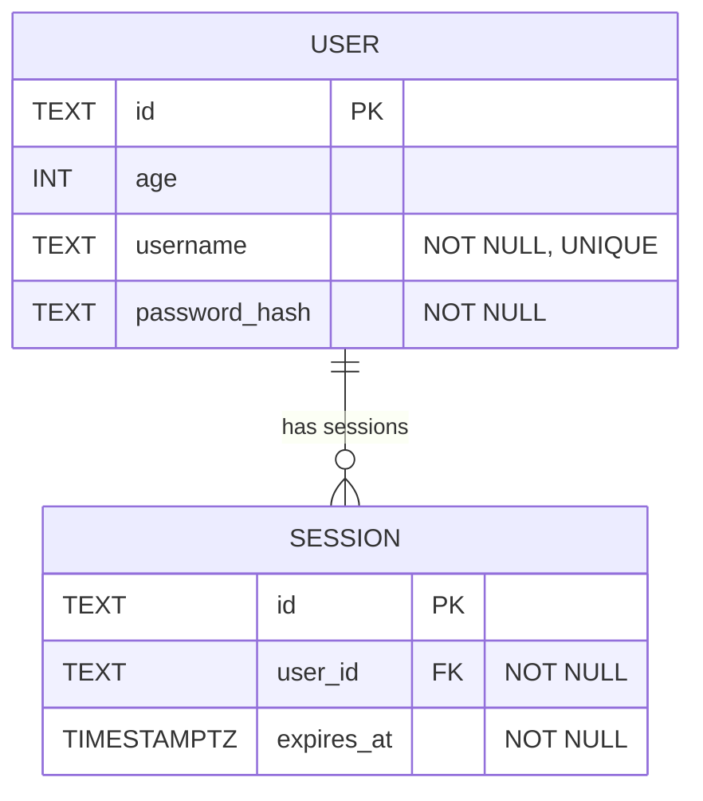

# Database Schema (Mermaid)

This document mirrors src/lib/server/db/schema.ts. Update this file whenever the TypeScript schema changes.

Details and constraints
- session.user_id → user.id (foreign key, required)
- user.username is UNIQUE and NOT NULL
- session.expires_at uses a timestamp with timezone (mode: date) and is NOT NULL
