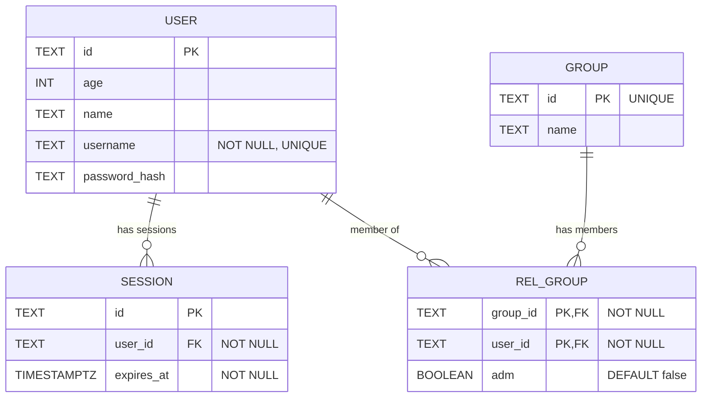

# Database Schema (Mermaid)

This document mirrors src/lib/db/schema.ts. Update this file whenever the TypeScript schema changes.

Details and constraints

- session.user_id → user.id (foreign key, required)
- user.username is UNIQUE and NOT NULL
- session.expires_at uses a timestamp with timezone (mode: date) and is NOT NULL
- group.id is UNIQUE and serves as the primary key
- rel_group has a composite primary key (group_id, user_id)
- rel_group.group_id → group.id (foreign key, required)
- rel_group.user_id → user.id (foreign key, required)
- rel_group.adm is a boolean flag indicating admin status

