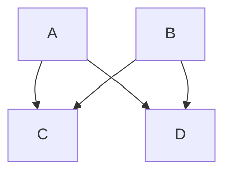

# Here’s a chart

- [Back](/doc)

---

- **The chart is rendered inside our MDsveX document.**



```json
{
	"teste": "Ok"
}
```

```java
public class Teste {
    public static void main(String... args) {
    }
}
```
